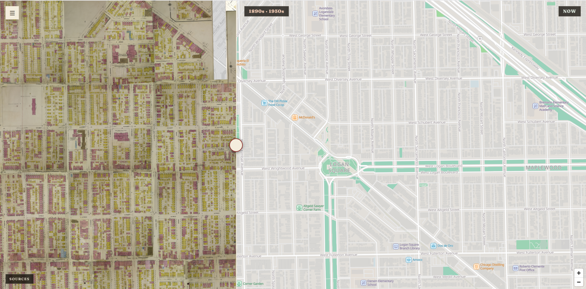

# autogeoref

Automatic georeferencing for scanned Sanborn fire insurance maps.

[Sanborn maps](https://www.loc.gov/collections/sanborn-maps/about-this-collection/)
are detailed street atlases of American cities, drawn between the
1860s and the 1960s for fire insurance underwriters. The Library of Congress has
scanned hundreds of thousands of pages, although only a portion of the corpus is digitized and freely accessible.

Working out where one of those pages sits on a modern street grid is slow,
careful work, and it is normally done by hand - see Adam Cox's excellent open, georeferencing platform
[OldInsuranceMaps.net](https://oldinsurancemaps.net).

This project provides an automated first pass at Sanborn georeferencing. A
vision model reads street names, rail lines, and house numbers off a scan. A
deterministic pipeline turns those labels into candidate intersections, looks
for the same intersections in modern street data, and fits a transform that
warps the page onto the map. Most of the work this repo does relates to validating Sanborn sheet placements.

One terminology note: A **volume** is one Sanborn atlas made up of many sheets. A **sheet** is one page inside a volume.

**[See it running on Chicago](https://autogeoref.com)**



## How well it works

Measured 2026-08-16 against human placements from OldInsuranceMaps.net, on the
36 volumes placed so far.

|                                           | Chicago (35 volumes) | Cleveland (1 volume) |
| ----------------------------------------- | -------------------- | -------------------- |
| Sheets placed and published               | 78% of 3,773         | 64%                  |
| Typical distance from the human placement | 5.4 m                | 9.6 m                |
| Published sheets more than 15 m off       | 10.8%                | 21%                  |

For a sense of scale, a standard Chicago city lot is 25 feet wide, about 7.6 m.

The Cleveland volume was run with settings tuned for Chicago, and that accounts
for much of the difference between the two columns.

Across all Chicago volumes, including ones with no human placement to compare
against, 75% of sheets pass the checks. Individual volumes range from 23% to
97%, so the overall figure does not tell you much about any single volume.

## How it works

[](docs/HOW-IT-WORKS.md)

1. A vision model reads the street name labels, rail lines, and house numbers
   off the scan and reports where each one sits on the page, in pixels.
2. Where two street names cross, that implies an intersection. The pipeline
   collects all of them.
3. It looks up those same intersections in modern street data, which gives it
   pairs of pixel positions and real coordinates.
4. It fits a transform from one to the other, using RANSAC to discard pairs that
   disagree with the rest. Further checks compare each sheet against the others
   in its volume, and against evidence the fit did not already use.
5. Sheets that pass are stretched onto the map, trimmed at the edges, stitched
   together, and packed into PMTiles for the web viewer.

The illustrated walkthrough [in Markdown](docs/HOW-IT-WORKS.md) or [in HTML](https://autogeoref.com/walkthrough) provides a step-by-step explainer of this system's multi-stage pipeline.

## Where it does not work well

The pipeline needs street names it can find on a modern map. It does badly when:

- The sheet is mostly park, water, or rail yard, so there are few street labels
  to work with.
- The street grid has changed a lot since the map was drawn. Highway
  construction, urban renewal, and filled-in shoreline all remove the streets
  the pipeline is looking for.
- The volume is not a street grid at all. For exampple, the 1933 Chicago world's fair site or the old Chicago stockyards have layouts that have no modern analog.
- Streets have been renamed (as was the case in parts of Chicago). This one is fixable by supplying a list that aliases old to
  new names, but the list has to be built per city.

## Getting the data

You do not have to run anything to use the output.

`exports/` holds the georeferencing for every published sheet, one directory per
volume:

- `gcps/p<N>.json` holds the ground control points for that sheet, pairing pixel
  positions on the original scan with WGS84 coordinates.
- `allmaps.json` is an IIIF Georeference annotation. It points at the Library of
  Congress's own image service, so a viewer such as
  [Allmaps](https://allmaps.org/) can warp the original scan without needing any
  imagery from this project.

All of it is released under CC0. See `exports/README.md` for more detail.

## Setup

Linux, or Windows through WSL. The Python is portable, but a couple of modules
read `/proc`, and the warp and queue paths shell out to `nice`.

You need Python 3.12 (pinned by `.python-version`),
[uv](https://docs.astral.sh/uv/), and GNU Make.

```sh
make setup      # uv sync --all-extras --dev --python 3.12, from the lockfile
git config core.hooksPath .githooks
make check
```

### GDAL

The warp, mask, mosaic, and tile stages shell out to GDAL, so it is a system
package rather than a Python dependency. `gdalwarp`, `gdal_translate`,
`gdalinfo`, and `gdal2tiles.py` all have to be on `PATH`. The placement stages
need none of it, and neither does `publish`.

GDAL 3.6 or newer, because tiling defaults to
`gdal2tiles.py --tiledriver=WEBP`. Measured on 3.8.4.

```sh
sudo apt-get install gdal-bin   # Debian/Ubuntu; 24.04 ships GDAL 3.8
brew install gdal               # macOS
```

Ubuntu's `gdal-bin` carries `gdal2tiles.py`; some distributions package it
separately as `python3-gdal`. Check with `gdal2tiles.py --version`.

### Model access

You need access to one vision model. Which one is set in the city config, and
you install and authenticate the provider yourself. The provider is a prefix on
the model name, and every stage that reads a sheet uses the same table, so
anything below works as `annotation_model`, as an `escalation_models` tier, or
both.

Three providers are command-line tools, spawned as subprocesses:

| Model reference in a city config | Executable | Credential                                   |
| -------------------------------- | ---------- | -------------------------------------------- |
| a bare name, or `anthropic:`     | `claude`   | that CLI's own login, or `ANTHROPIC_API_KEY` |
| `codex:`                         | `codex`    | that CLI's own login                         |
| `opencode:`                      | `opencode` | that CLI's own configured credentials        |

Three more can be called over HTTP:

| Model reference  | Reaches                      | Install                              | Credential          |
| ---------------- | ---------------------------- | ------------------------------------ | ------------------- |
| `anthropic-api:` | the Anthropic Messages API   | `pip install 'autogeoref[annotate]'` | `ANTHROPIC_API_KEY` |
| `openai-api:`    | the OpenAI Responses API     | `pip install 'autogeoref[openai]'`   | `OPENAI_API_KEY`    |
| `ollama:`        | a local Ollama's `/api/chat` | the Ollama daemon                    | none                |

`autogeoref run` checks for a missing CLI before it preps or spends anything. Each SDK is an optional extra
imported on first use, and a missing one names the extra that installs it.
`make setup` installs both.

Reasoning effort is configured beside the model as `annotation_variant` and
`escalation_variants`, and is accepted by `codex:`, `opencode:` and
`openai-api:`.

### User Agent for Data Fetching

Set `AUTOGEOREF_CONTACT` to a reachable email address or URL before fetching
anything. It is the contact in the User-Agent that the Library of Congress and
Overpass clients send. Left unset it falls back to this repository's URL. It is read once at import, so it has
to be in the environment before the process starts.

```sh
export AUTOGEOREF_CONTACT="you@example.org"
```

### Frontend tooling

`make setup-js` installs the frontend linter. It is separate from `make setup`
because npm is a development dependency only. The viewer deploys as file copies
with no build step.

The frontend tests additionally need `node` and a headless Chrome or Chromium.

## Quick start

Two commands to a priced, unspent run:

```sh
uv run autogeoref prep <volume> --work work
uv run autogeoref run <volume> --city <city-config> --work work --dry-run
```

`configs/staunton/staunton.toml` is a good first city. It is a single 14-sheet
1948 volume, `sanborn02165_007`, and it needs no data beyond this clone. The
pipeline placed 11 of its 12 detail sheets on 19 model calls, with no list of
renamed streets. Checked afterwards against the streets actually drawn on the
sheets, the typical placed sheet sits 2.2 m from where it belongs.
`docs/ADDING-A-CITY.md` walks through it.

```sh
uv run autogeoref run <volume> --city <city-config> --work work
uv run autogeoref report <volume> --work work
```

`make help` lists the safe shortcuts. `uv run autogeoref --help` and
`uv run autogeoref <command> --help` are the authoritative option reference.

## Guides

| Need                                                           | Read                    |
| -------------------------------------------------------------- | ----------------------- |
| What the pipeline does, step by step                           | `docs/HOW-IT-WORKS.md`  |
| Running it: place, score, queue, review, bake, publish, deploy | `docs/OPERATIONS.md`    |
| City and per-volume configuration                              | `docs/ADDING-A-CITY.md` |
| Mask, verified-accept, and alias contracts                     | `docs/INTERNALS.md`     |
| Test data, its integrity, and its traps                        | `FIXTURES.md`           |
| Scripts and one-off tools                                      | `scripts/README.md`     |

## Development commands

```sh
make test-fast  # fast suite
make test       # complete suite, including fixture and GDAL tests
make test-golden
make test-gdal
make test-file TEST=tests/test_queue_drain.py
make lint       # ruff, docstring budget, import contracts, frontend linter
make lint-py    # the Python half alone (no npm; what the container runs)
make lint-js    # the frontend linter alone (needs make setup-js once)
make typecheck
make check      # lint + typecheck + fast suite
make candidates CITY=configs/chicago/chicago.toml
make prep VOLUME=sanborn01790_024
make report VOLUME=sanborn01790_024
make viewer     # local viewer at http://127.0.0.1:8123/viewer/
make status     # volumes already in work/, read from disk
```

## Layout

- `src/autogeoref/` is the pipeline, CLI, and viewer support.
- `configs/` is city and volume configuration.
- `exports/` is the researcher-facing data: per-volume control point records and
  Allmaps annotations, rewritten by every publish.
- `fixtures/` is gitignored, integrity-pinned test data. See `FIXTURES.md`.
- `work/` is gitignored processing artifacts.
- `viewer/` is the static MapLibre viewer and its vendored dependencies.
- `docs/` is the four guides above.

### The Dockerfile

The Dockerfile is (currently) not a way to run the pipeline. It is only used as a CI check,
to confirm that the setup steps in this README work on a fresh clone on a
machine that has never seen the project.

## Data provenance and rights

Where each body of data came from and on what terms.

**Map scans** come from the Library of Congress
[Sanborn Maps Collection](https://www.loc.gov/collections/sanborn-maps/), for
which the LOC states no known restrictions. No scan is redistributed here. The
walkthrough figures under `viewer/walkthrough/` are crops of them.

**The accuracy reference** is the human georeferencing produced by volunteers at
[OldInsuranceMaps.net](https://oldinsurancemaps.net). Every accuracy figure in
this project is measured against their work. The platform is described in:

> Cox, Adam. "Toward a Georeferencing Commons: A Crowdsourcing Case Study and
> the Creation of OldInsuranceMaps.net." _Journal of Map & Geography
> Libraries_ 19, no. 3 (2024): 160–184.
> [doi:10.1080/15420353.2024.2326812](https://doi.org/10.1080/15420353.2024.2326812)

**OpenStreetMap** supplies street geometry in cities that publish no centerline
file of their own, and rail everywhere, so published coordinates are derived
from it: _© OpenStreetMap contributors_,
[ODbL](https://opendatacommons.org/licenses/odbl/).

**`exports/` is released under [CC0 1.0][cc0]**, public domain dedication, no
attribution required. It holds this pipeline's own output: per-volume control
point records and Allmaps annotations. The dedication is machine-readable as the
`rights` property of every annotation and annotation page, restated in
`exports/README.md`, and both are regenerated by every publish.

**Vendored viewer dependencies** (`viewer/vendor/`) are third-party code, fonts,
sprites, and basemap styles, each pinned with its version, source URL, and
license in `viewer/vendor/NOTICE.md`.

**Everything else tracked here is this project's own work** and falls under
`LICENSE` (MIT).

[cc0]: https://creativecommons.org/publicdomain/zero/1.0/
