### Note

_This doc was generated by an LLM._

# How a scanned atlas becomes a map

The whole pipeline in 21 steps, following one volume: Chicago, Ill., 1905, Vol.
17, 133 sheets. Two of the steps need something that volume does not have (a
plainly misread sheet, and a volume a volunteer hand-placed) and name the atlas
they borrow in their own figures.

Every figure is rendered from a real run by
`scripts/walkthrough/make_walkthrough_assets.py`. Nothing is a mock-up and no
number is typed by hand: the generator calls the pipeline's own functions and
refuses to draw a page whose figures disagree with the record on disk.

The same walkthrough runs as a stepper at `/walkthrough.html` beside the map
viewer, where each panel's prepared states can be compared side by side. This
page is all of it in one scroll.

Two steps are told out of run order and say so where they appear. Thresholds
live with the modules that enforce them, and `docs/INTERNALS.md` carries the
detail behind the evidence vote.

---

## I. From a scan to a reading

### 1. A map of somewhere, and nowhere

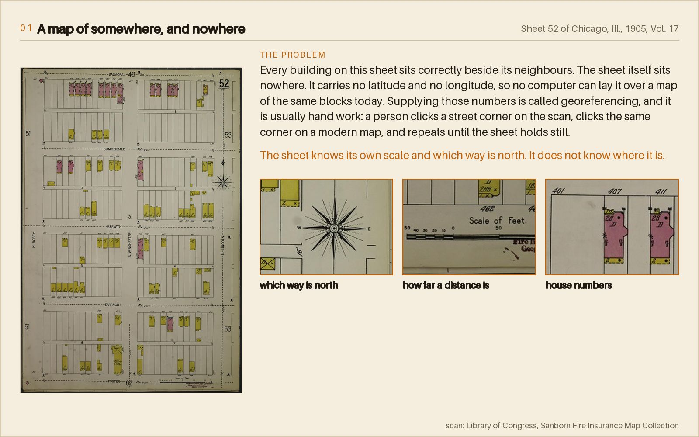

This is one sheet of a fire-insurance atlas: a block-by-block survey of a city,
drawn so an underwriter could see what every building was made of. It is exact
about the things it cares about and silent about the one a computer needs. There
is a scale bar and a north arrow, but no coordinates anywhere on the page, so
nothing tells software which patch of ground the drawing covers. Someone has to
say. Doing it by hand means clicking a street corner on the scan, clicking the
same corner on a modern map, and repeating until the sheet stops sliding around.
That is a few minutes per sheet, and there are thousands of sheets.

|  |  |
| --- | --- |
| Sheet | page 52 |
| Volume | Chicago, Ill., 1905, Vol. 17 |

### 2. One scan, two sizes

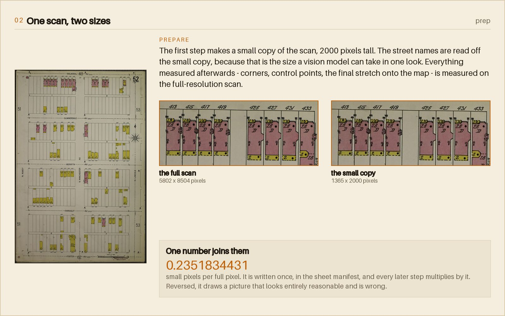

Preparation makes a second, smaller copy of each scan and writes down the ratio
between them. The two sizes have different jobs. The small copy is what a vision
model reads, because a model sees a whole image at once and a 5,000-pixel-wide
page would arrive as mush. The full-resolution scan is what every measurement
afterwards uses, because a corner located to the nearest small pixel is only
located to within 4 full pixels on the ground. Keeping both, and keeping the
conversion in exactly one file, is what stops the two frames being mixed up
later.

|  |  |
| --- | --- |
| Full scan | 5802 x 8504 px |
| Small copy | 1365 x 2000 px |
| Ratio | 0.235183 |

### 3. Reading the street names

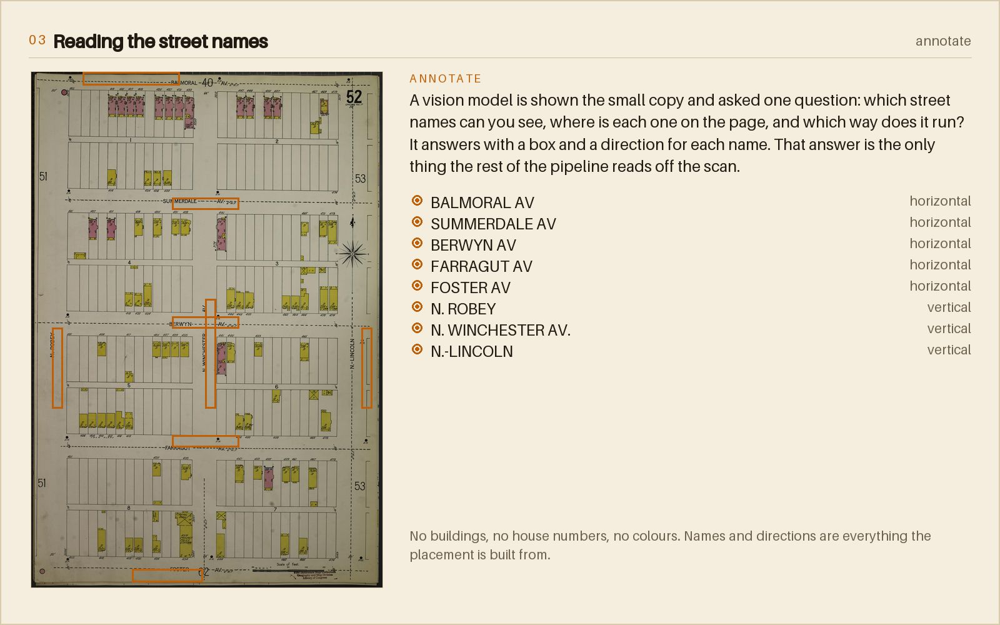

This is the only step that looks at the drawing. A vision model is given the
small copy and asked for the street names it can see, where each one sits on the
page, and whether it runs across the sheet or down it. Nothing else on the sheet
is read: not the buildings, not the house numbers, not the colours that tell an
underwriter what a wall is made of. Each reading is kept on disk, so the same
reader is never paid twice for the same sheet, and everything after this point
is arithmetic on those few names.

|  |  |
| --- | --- |
| Names returned | 8 |

### 4. When the first read comes back wrong

| First reading | Second reading |
| --- | --- |
| 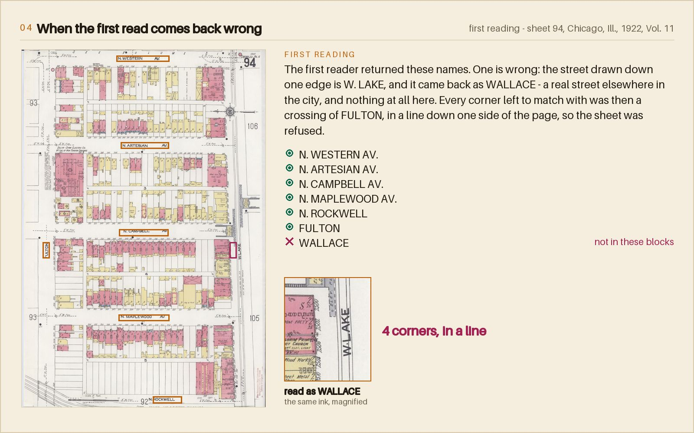 | 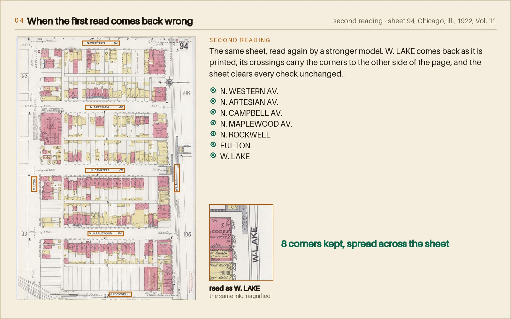 |

Readers make mistakes, and one bad name can sink a sheet. The heavy W. LAKE down
one edge of this sheet came back as WALLACE. Wallace is a real Chicago street,
but it is miles from these blocks, so nothing on the modern map of them answers
to it. Every corner the pipeline could still find, all 4 of them, was then a
crossing of FULTON, and they fell in a straight line down one side of the page.
A line will not hold a sheet down. Slide the whole placement along it and the
corners still match, so the checks refuse it: they want corners spread across
the sheet, not strung along an edge. Refusal is not the end. A sheet that fails
is offered to a stronger reader, cheapest first, and if a later reading passes
the same unchanged checks it is kept. Nothing is loosened to let it through; the
sheet simply gets a better look.

|  |  |
| --- | --- |
| Sheet | page 94, Chicago, Ill., 1922, Vol. 11 |
| Corners offered | 4, then 9 |
| Second reader | codex:gpt-5.6-terra |
| Corners the fit kept | 0, then 8 |

> **Order note:** a run does this AFTER the fit of steps 5 to 10, on the sheets
> those steps refused. It is told here because it is about reading, and because
> a re-read sheet is put through those same steps, unchanged, to earn its place.
> This one sheet comes from another atlas in the same corpus: the volume the
> rest of this walkthrough follows has no sheet whose first read went wrong this
> plainly.

---

## II. From a reading to a fit

### 5. The book decides, not the page

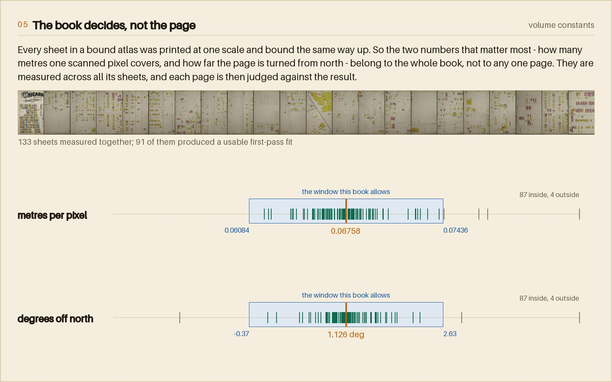

This is the idea most often missed about the system. A single sheet cannot be
checked on its own: any three corners can be joined by some stretch of the page,
and a wrong stretch looks as convincing as a right one. A bound volume can be
checked, because its sheets were printed at one scale and bound the same way up.
So a first pass fits every sheet with no constraints at all and takes the middle
value of what comes back. Every sheet is then refitted against a narrow window,
and a fit landing outside it is refused however neat it looks by itself. A
volume whose scale and turn are already known can declare them instead, and this
one does, so the marks below read as a check: the measurement and the
declaration land in the same place.

|  |  |
| --- | --- |
| Measured scale | 0.067577 m per pixel |
| Measured rotation | 1.126 deg |
| Scale window | 0.06084 to 0.07436 |
| Rotation window | -0.37 to 2.63 deg |

### 6. A name points along its street

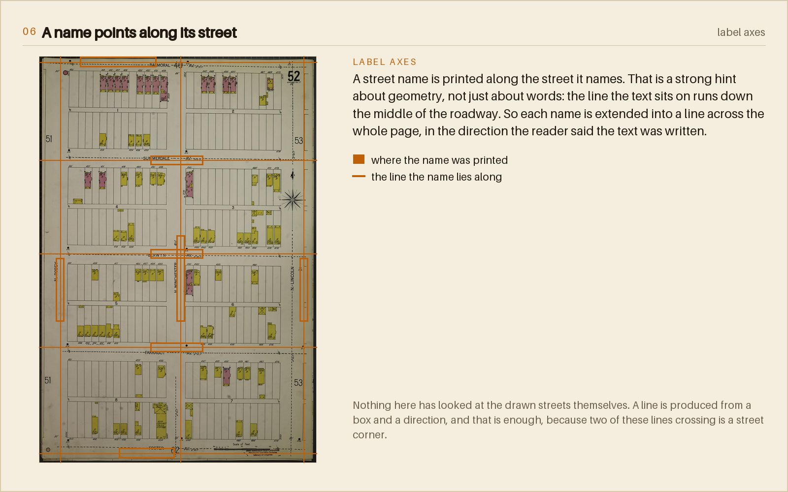

Street names on an atlas sheet are set along the roadway they name, so the line
the lettering sits on is a good stand-in for the street itself. Extending each
name into a full-width line turns a handful of words into a handful of lines,
and lines can be crossed. This is why the reading step asks for a direction as
well as a name: a name printed across the sheet and the same name printed down
it produce completely different lines.

|  |  |
| --- | --- |
| Names on this sheet | 8 |

### 7. Where two names cross

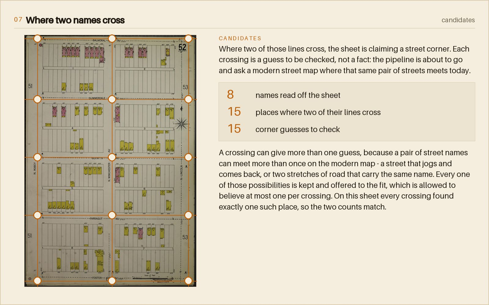

Two crossed lines on the page are the sheet saying that these streets meet
here`. That claim is looked up on a modern street map, and the answer is not
always a single point. Streets jog around a park and pick up again; a name can
belong to two separate stretches of road. Each possible modern location becomes
its own guess, so the guesses can outnumber the crossings: here each of the 15
found exactly one. Nothing is chosen yet. The next step is what decides which of
them can be true at the same time.

|  |  |
| --- | --- |
| Crossings on the page | 15 |
| Corner guesses | 15 |

### 8. The same corner on a modern map

| Renames on | Renames off |
| --- | --- |
| 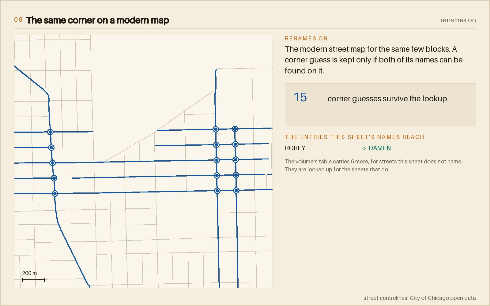 | 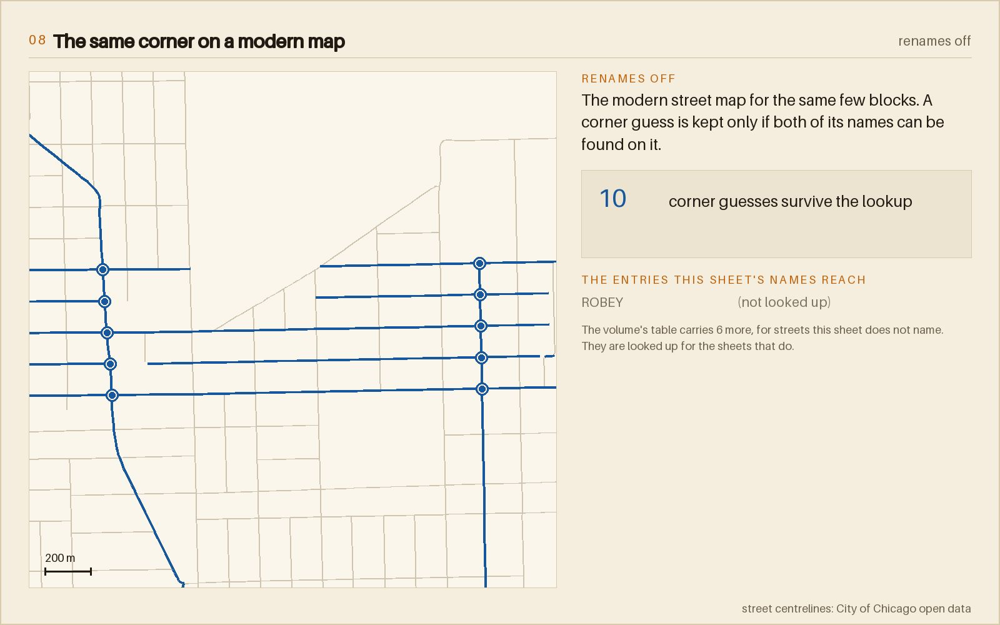 |

Every corner guess is now looked up in a modern file of street centrelines: two
street names go in, real-world coordinates come out. This is where a century
gets in the way. Streets are renamed, and a name printed in 1905 may match
nothing at all today, so the volume carries a small table of historic-to-modern
names. It is a plain list, written and checked by hand for each volume, not a
guess made at run time. The table belongs to the whole book, so most of it says
nothing about any one sheet: of its 7 entries only 1 reaches a name printed on
this one, ROBEY to DAMEN. That entry is the whole of the difference below: the
same sheet, the same reading, and fewer corners left to work with once it is
switched off.

|  |  |
| --- | --- |
| Renames in this volume's table | 7 |
| Of those, used by this sheet | 1 |
| Corner guesses with the table | 15 |
| Corner guesses without it | 10 |

### 9. Which corners agree

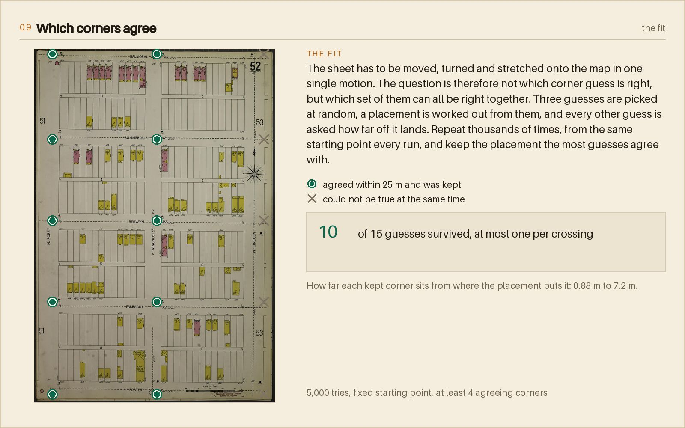

A placement here is one flat transformation (slide, turn, stretch) applied to
the whole sheet at once. Because it is one transformation, the corner guesses
have to agree with each other, and most of the wrong ones cannot. The search is
simple and repeatable: take three guesses at random, work out the placement they
imply, count how many of the rest land within 25 metres of where that placement
predicts, and remember the best. The random draws start from the same fixed
point every run, so the same sheet always gives the same answer.

|  |  |
| --- | --- |
| Corner guesses | 15 |
| Corners kept | 10 |
| Agreement tolerance | 25 m |
| Tries | 5,000 |
| Worst kept corner | 7.15 m |

### 10. Seven ways to say no

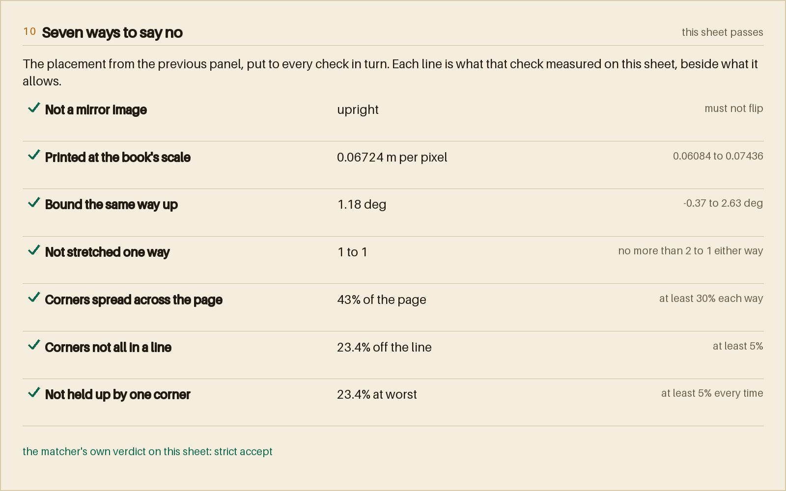

A placement can agree with itself and still be wrong. Seven checks, called the
gates, stand between a fit and a committed sheet, and they were added one at a
time, each after a confidently wrong placement got past the ones already there.
A sheet that clears all seven is a strict accept. Four of the checks ask about
the shape of the transformation: is the page flipped, resized, turned, or
stretched out of true. Three ask about the corners it rests on: are they spread
across the page, do they form a shape rather than a line, and does that shape
survive losing any one of them. Each panel here hands the matcher a broken
version of this sheet's own corners and shows how it reports the refusal.

|  |  |  |
| --- | --- | --- |
| 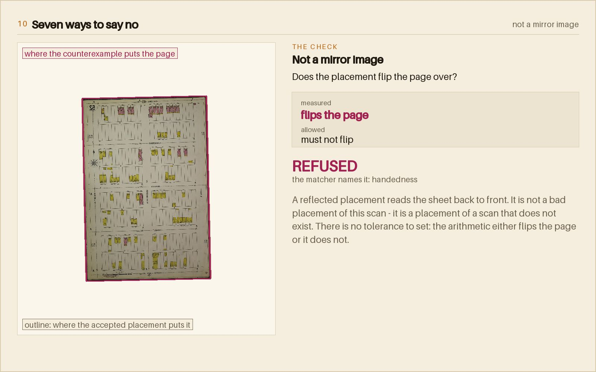 | 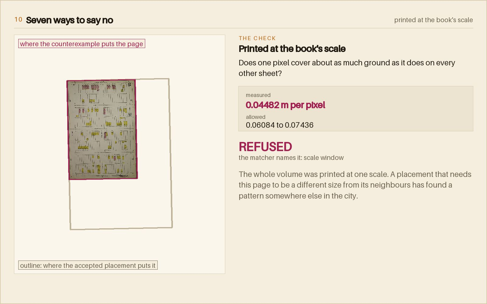 | 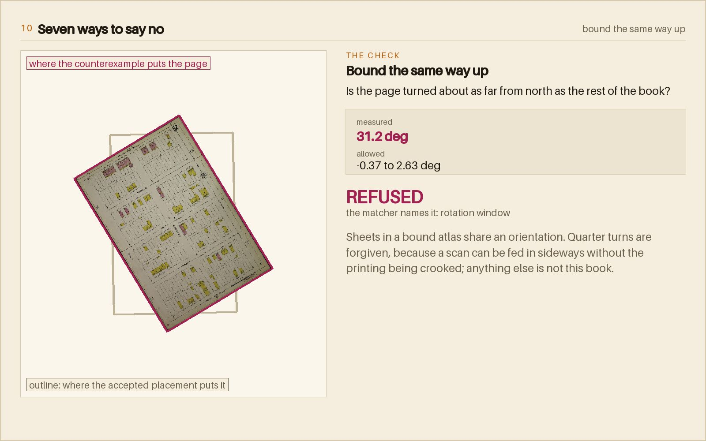 |
| 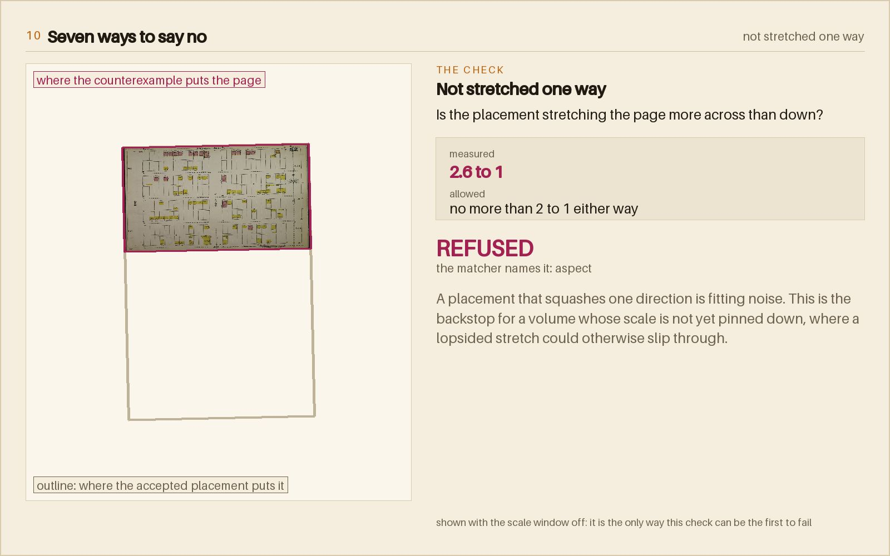 | 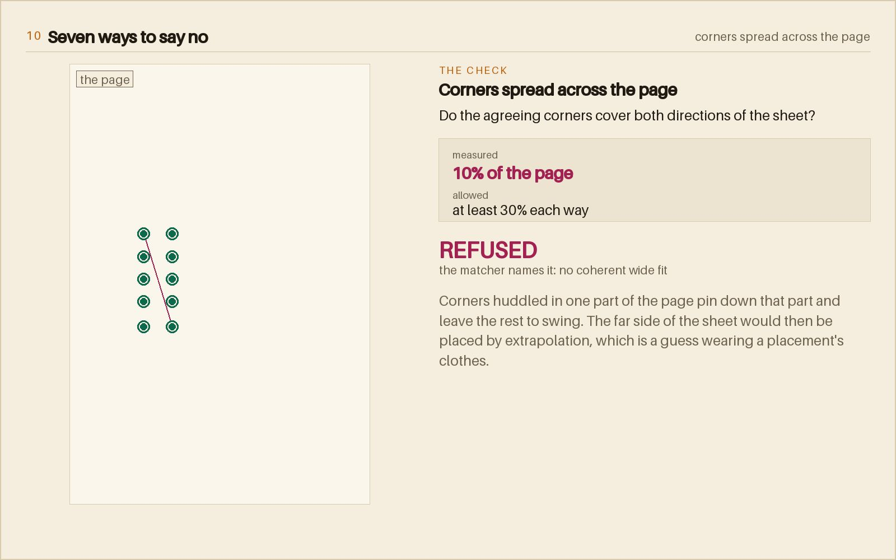 | 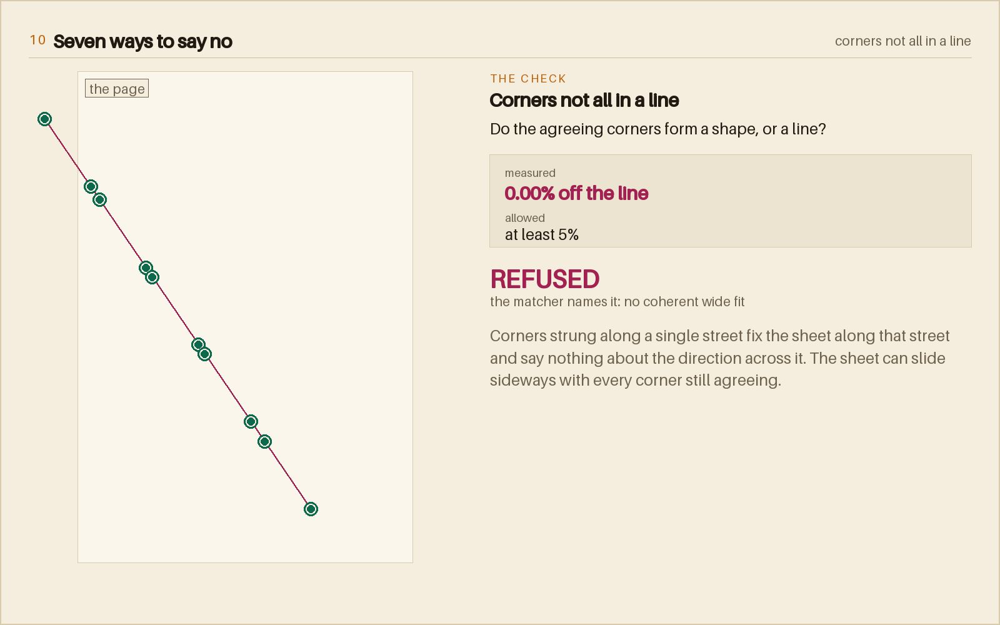 |
| 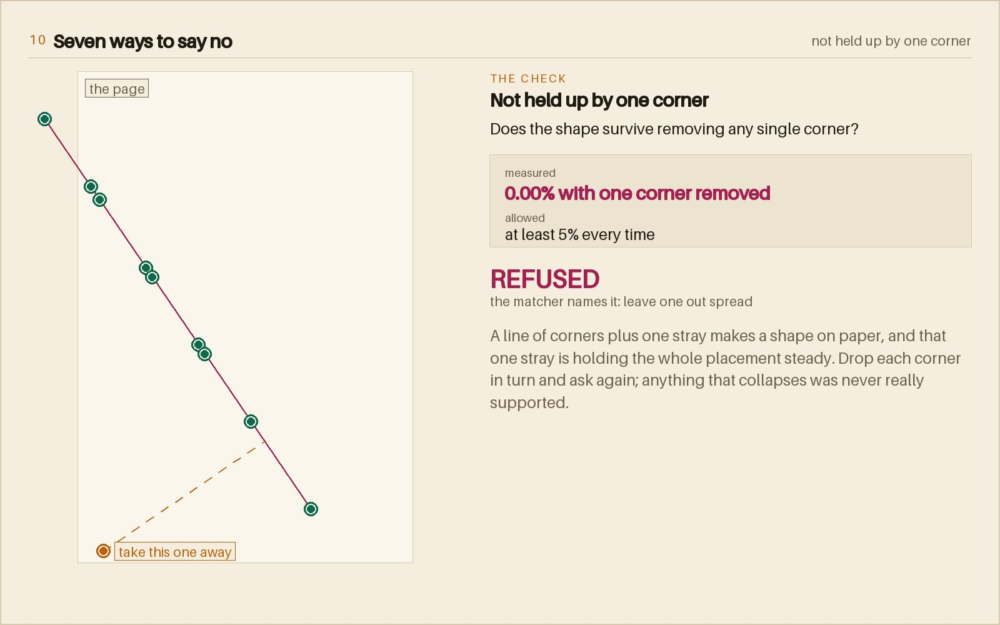 |  |  |

|  |  |
| --- | --- |
| Checks | 7 |
| Minimum corners | 4 |
| Spread across the page | 30% each way |
| Spread off the line | 5% |

---

## III. Second chances

### 11. A second chance, on the book's terms

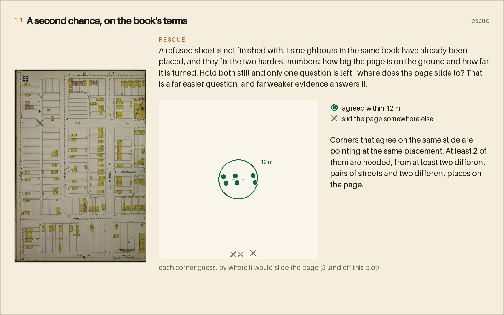

The strict fit has to discover six things at once, two for position and four
more for size, turn and stretch, so it insists on four well-spread corners:
three would pin the six down exactly, with nothing left over to contradict a
mistake. Once the rest of the volume has been placed, four of those six are
already known and are simply held fixed. All that remains is how far the page
slides north and east. Two corners that agree on the same slide are then real
evidence rather than a coincidence, and sheets that could never have cleared the
strict fit come back. This second attempt is called rescue. Some sheets are not
drawn the way the rest of the book is: a district printed sideways, or on a
local street grid at its own angle. Holding the book's turn fixed is then
holding the wrong one, and nothing can agree, so when the book's turn finds
nothing the page's own turn is tried instead, read off which of its street
labels it calls horizontal and vertical. That is a weaker source than the book,
so it is asked for more: three agreeing corners rather than two, and only ever
where the book's own turn had already come up empty.

|  |  |
| --- | --- |
| Sheet | page 59 |
| Pinned scale | 0.0676 m per pixel |
| Pinned turn | 1.13 deg |
| Corners that agreed | 6 |
| Agreement tolerance | 12 m |
| Status | OK (rescued) |

### 12. All on one street is not enough

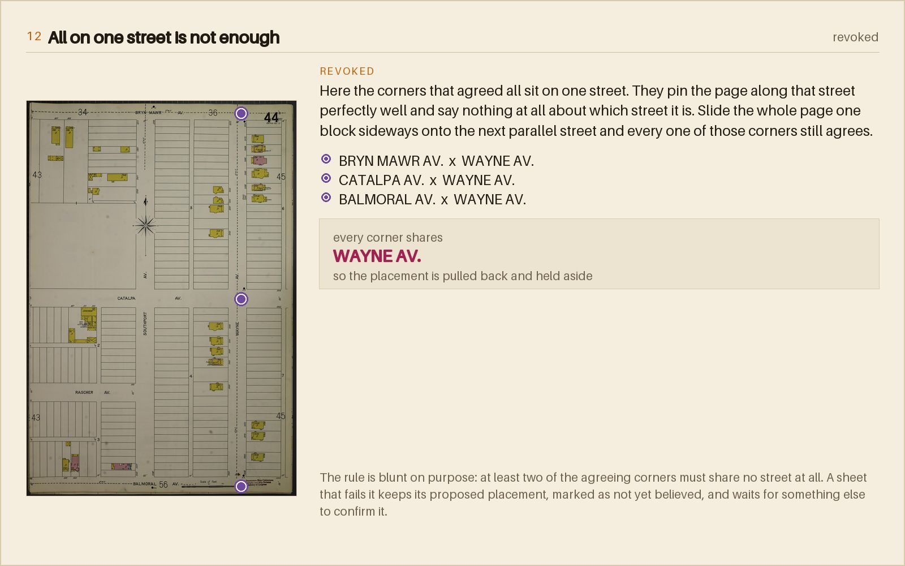

This is the failure the rescue step is most exposed to. A city grid is full of
parallel streets a block apart, and a set of corners that all lie on one of them
fits the street next door exactly as well. Nothing in the arithmetic can see the
difference, so the answer is a rule about the evidence rather than a cleverer
measurement: unless two of the agreeing corners share no street between them,
the placement is withdrawn. A sheet in that state is called revoked. It is
recorded as a proposal rather than discarded, and passed to the two steps that
follow, which can settle it with evidence the matcher never saw.

|  |  |
| --- | --- |
| Sheet | page 44 |
| Corners that agreed | 3 |
| Street they all share | WAYNE AV. |
| Status | OK (verified: junction+addresses) |

### 13. The neighbours already know

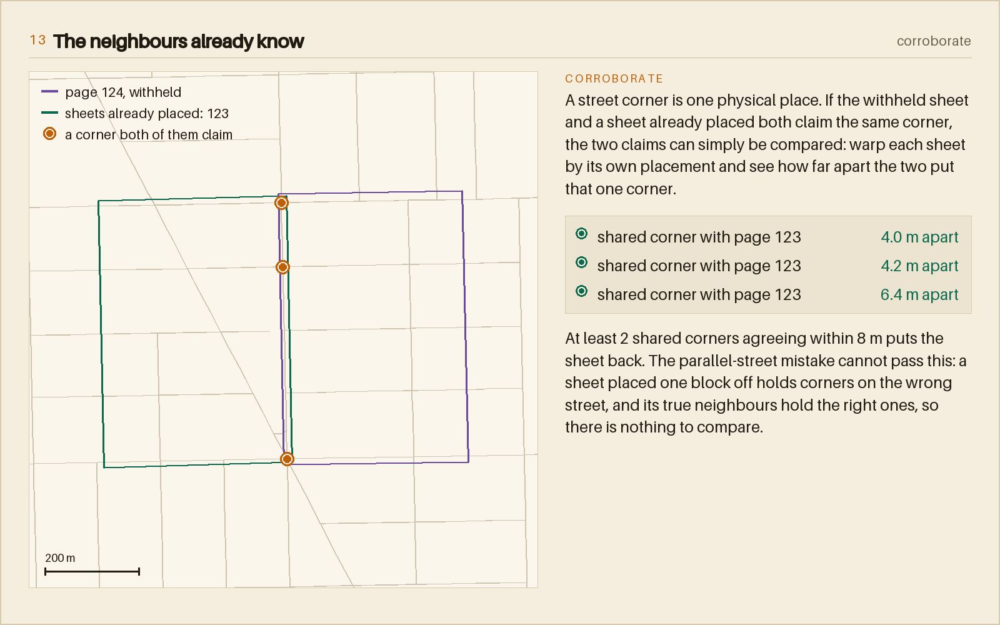

Sheets in an atlas overlap at their edges, so the same street corner often
appears on two of them. That is the opening. Take a sheet whose placement was
withdrawn, find corners it shares with sheets already accepted, and measure how
far apart the two placements put each one. This check is called corroboration,
and agreement here cannot be arranged: a sheet placed one block off along a
street simply has no corners in common with the sheets around it, so it has
nothing to agree with and stays withheld.

|  |  |
| --- | --- |
| Sheet | page 124 |
| Shared corners agreeing | 3 |
| Needed | 2 within 8 m |
| Status | OK (rescued, neighbor-corroborated) |

> **Order note:** a run does this AFTER the seam solve of step 16, not before
> it. The neighbours have already been nudged into line with each other by then,
> so what is compared here is the tidied frame, which is the whole reason the
> seam solve runs first.

### 14. Evidence the matcher never saw

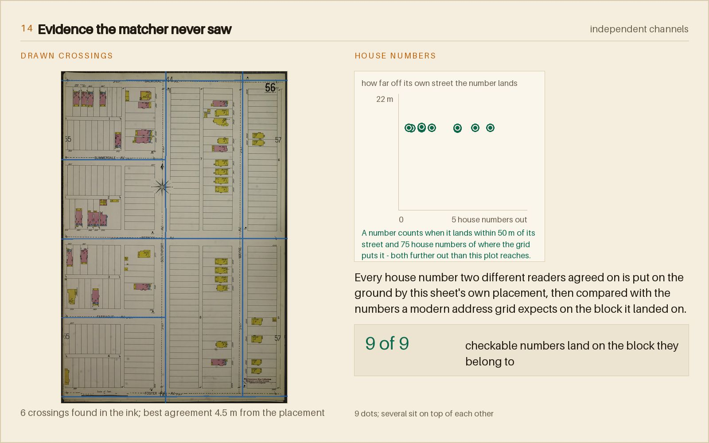

The matcher only ever looked at street names. Two other things on the same page
can be checked against the placement it proposed, and neither had any part in
producing it. The first is the ink itself: where the drawn streets cross,
compared with where a modern map says those crossings are. The second is the
house numbers printed along every block, compared with the numbers a modern
address grid expects there. Both are simply asked whether the proposed placement
makes sense; neither can move it.

|  |  |
| --- | --- |
| Sheet | page 56 |
| Drawn crossings found | 6 |
| Best agreement | 4.5 m |
| House numbers two readers agreed on | 13 |
| Of those, on the right block | 9 |

### 15. Two voices, and nothing against

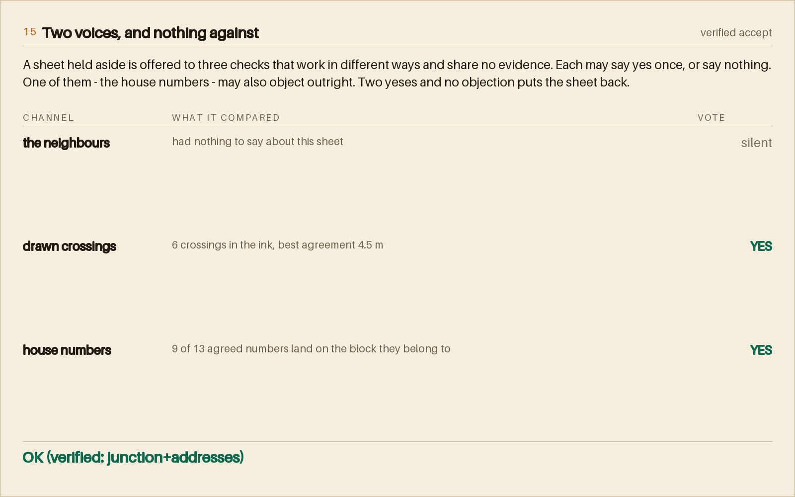

The last of the second chances is a vote, and its value is entirely in the
independence of the voters. The neighbours check knows about corners shared with
other sheets. The crossings check knows about ink on this page. The house-number
check knows about printed numbers and a modern address grid. None of them uses
the street names the placement was built from, so agreement between two of them
is not the same reasoning counted twice. One voice is never enough, and the
house-number check is the only one allowed to object. This vote is called
verified accept, and if the house numbers object, the sheet stays flagged
however many others agreed.

|  |  |
| --- | --- |
| Sheet | page 56 |
| Checks available | 3 |
| Agreement needed | 2 |
| Result | OK (verified: junction+addresses) |

---

## IV. The volume settles

### 16. Closing the seams

| Before | After |
| --- | --- |
| 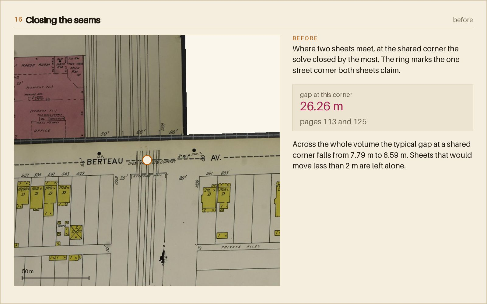 | 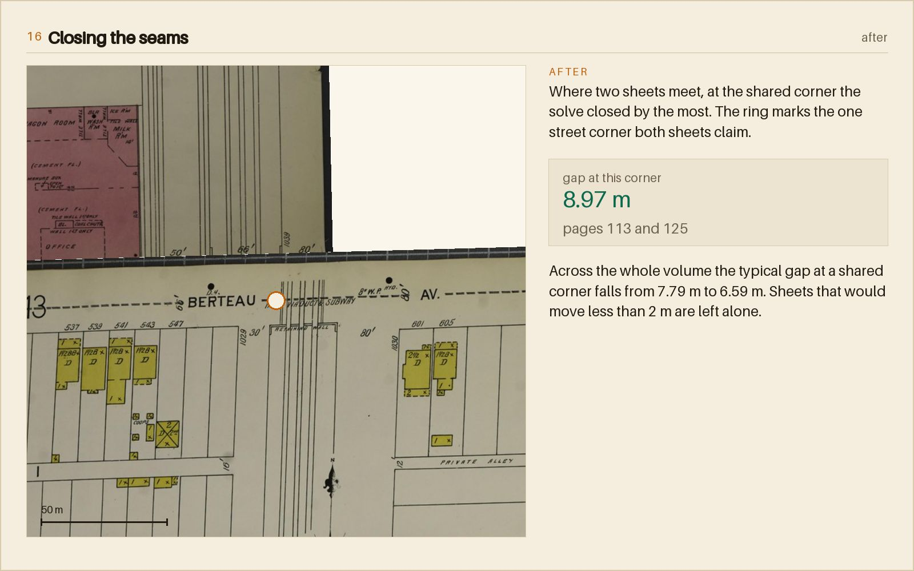 |

Each sheet is placed on its own, so two neighbours can be wrong in opposite
directions and the street that runs between them arrives at the shared edge
twice, in two different places. The fix treats the whole volume at once. Every
corner that appears on two sheets becomes a request that those two sheets agree
there, and one calculation finds the small nudge for each sheet that satisfies
as many requests as possible. Only sliding is allowed, with no sheet resized or
turned, and a pull towards where each sheet already was keeps the volume
anchored to its own evidence rather than drifting off together.

|  |  |
| --- | --- |
| Shared corners | 274 |
| Typical gap before (RMS) | 7.79 m |
| Typical gap after (RMS) | 6.59 m |
| Sheets nudged | 47 |
| The corner shown, before | 26.3 m apart |
| The same corner, after | 8.97 m apart |

> **Order note:** a run does this BEFORE the neighbour check of step 13. It is
> told here because a seam is easier to see once the second chances are in view,
> but the comparison in step 13 is made against the tidied positions this step
> produces.

---

## V. Becoming a map

### 17. Onto the ground

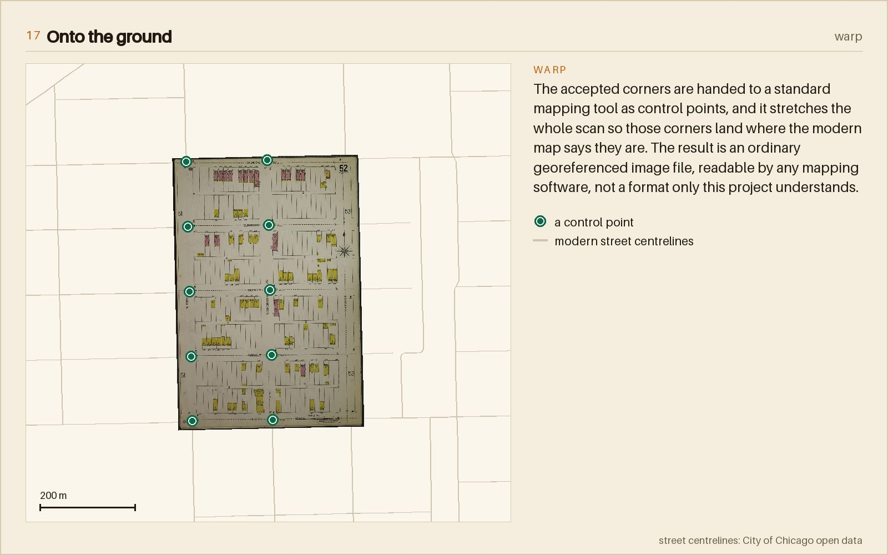

Up to here the placement has been a handful of numbers. This is where it becomes
an image sitting on the ground. The corners the fit kept are written out as
control points and passed to standard mapping software, which stretches the scan
so that every one of them lands on its modern coordinates. What comes out is a
cloud-optimised GeoTIFF, a plain, widely readable format that any mapping tool
can open, and that a web viewer can read a piece of at a time instead of
downloading whole.

|  |  |
| --- | --- |
| Sheet | page 52 |
| Control points written | 10 |

### 18. Trimming the margins

| Whole page | Trimmed |
| --- | --- |
| 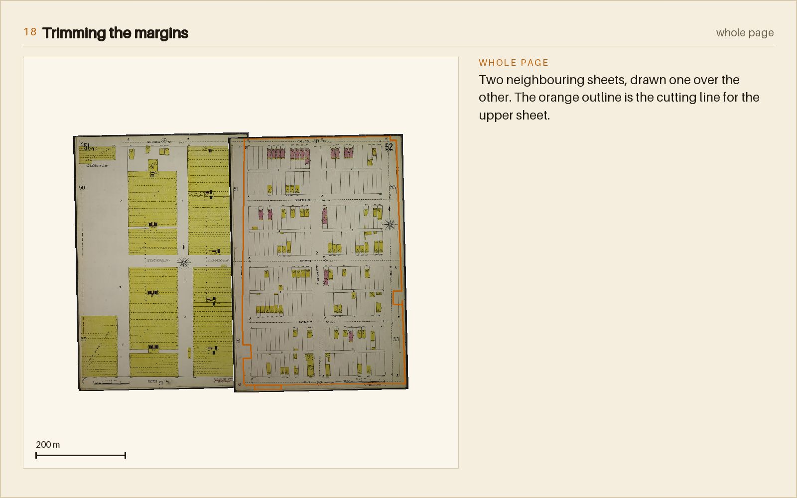 | 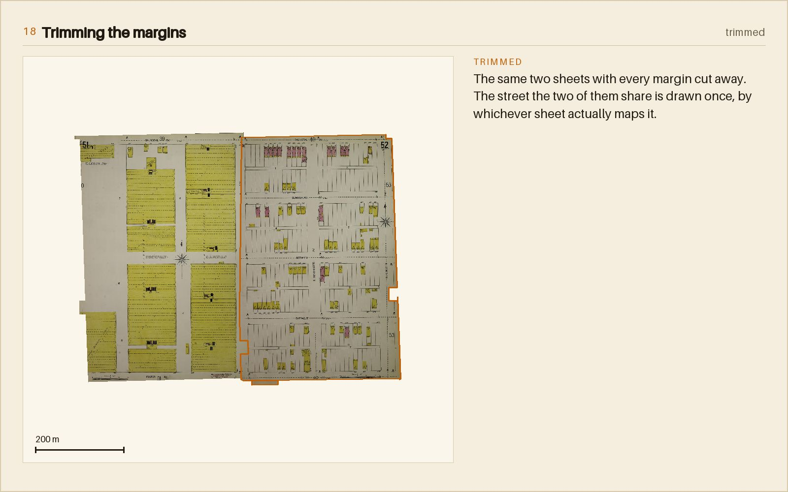 |

An atlas page is not all map. There is a printed border, a page number, a
compass rose, a title block and a scale bar, and once the page is stretched onto
the ground all of that lies over real streets, usually the ones the next sheet
along is drawing properly. So each sheet gets a cutting outline that follows the
edge of its mapped area, and everything outside it is made transparent. The
furniture stays in the archived scan and disappears from the map.

|  |  |
| --- | --- |
| Sheet | page 52 |
| Neighbour | page 51 |

### 19. One surface, cut into tiles

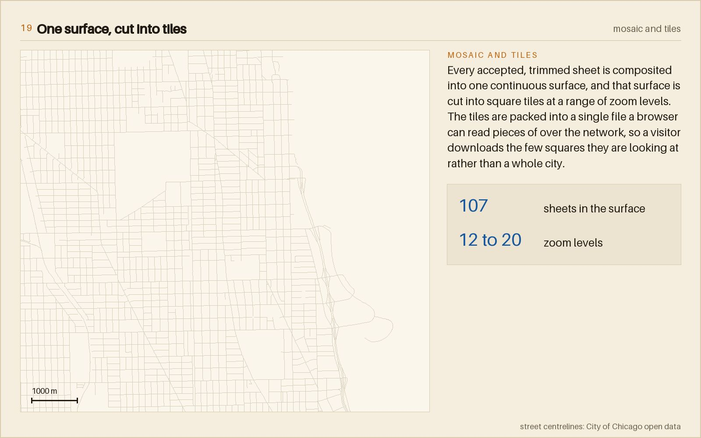

This is the volume, assembled. Every accepted sheet has been trimmed to its
mapped area and composited into one continuous surface, and the gaps are the
sheets the pipeline refused. They are not filled in or approximated. The surface
is then cut into square tiles at every zoom level a reader might want and packed
into a single file that a web map reads a piece at a time. No server is
involved: the file sits in storage and the browser asks for the bytes it needs.

|  |  |
| --- | --- |
| Sheets in the surface | 107 |
| Zoom levels | 12 to 20 |

---

## VI. Grading, afterwards

### 20. Where the sheets ended up

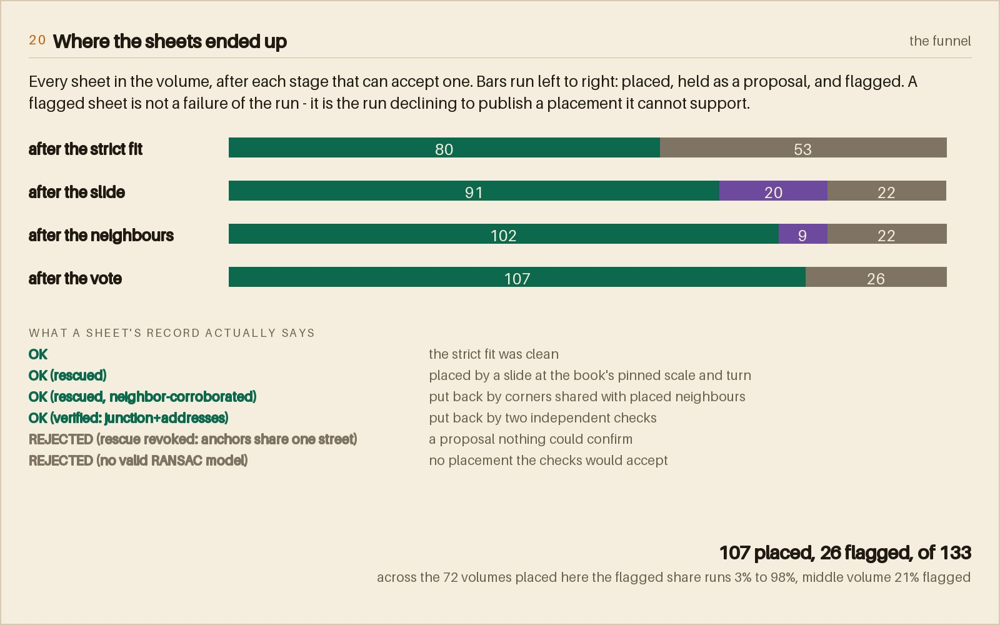

The pipeline does not place every sheet. It places every sheet the evidence
supports and flags the rest. How large that rest is varies enormously from one
volume to the next, and the spread is itself the honest picture: a book of
ordinary street grids gives up almost everything, while a book of rail yards or
a world's fair site can give up nothing at all. Refusing is the design working.
A wrong sheet published quietly is worse than a missing one, because a reader
has no way to tell it is wrong. Each status below is the literal text written
into that sheet's record, so an operator reading the files sees the same
vocabulary as a reader of this page.

|  |  |
| --- | --- |
| Sheets | 133 |
| Placed | 107 |
| Flagged | 26 |
| Flagged share | 20% |
| Volumes measured | 72 |
| Flagged share across them | 3% to 98% |
| Middle volume | 21% flagged |
| The strict fit was clean | OK |
| Placed by a slide at the book's pinned scale and turn | OK (rescued) |
| Put back by corners shared with placed neighbours | OK (rescued, neighbor-corroborated) |
| Put back by two independent checks | OK (verified: junction+addresses) |
| A proposal nothing could confirm | REJECTED (rescue revoked: anchors share one street) |
| No placement the checks would accept | REJECTED (no valid RANSAC model) |

### 21. Marked afterwards, never during

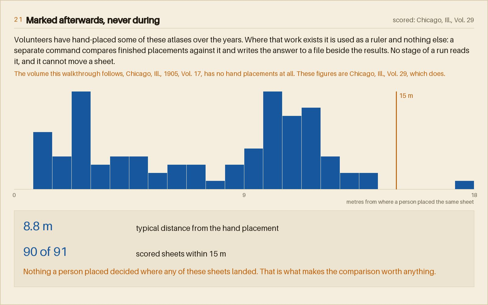

There is an obvious temptation with a system like this: if someone has already
placed a sheet by hand, use it. Doing so would destroy the only honest
measurement available, because a pipeline that has seen the answer cannot be
tested against it. So hand placements are kept strictly outside every run. They
are used by one separate command, afterwards, which writes its comparison to a
file beside the results and never onto a sheet's record. The volume this
walkthrough follows has no hand placements at all; the figures here come from
one that does. The yardstick exists only where a volunteer happened to place a
volume by hand, which is a small part of the corpus and never the part a run
reads.

|  |  |
| --- | --- |
| Volume graded | Chicago, Ill., Vol. 29 |
| Sheets scored | 91 |
| Typical distance | 8.83 m |
| Within the gate | 90 of 91 |

---

## A few words

**sheet** one page of a bound atlas, and the unit everything here works on
**volume** one bound atlas: a few hundred sheets printed at the same scale
**corner** a street junction the pipeline believes it has found on both the scan
and a modern map
**placement** the single slide, turn and stretch that puts a whole sheet on the
ground
**flagged** a sheet the pipeline refused to place, and says so about
**gate** one of the seven checks a placement clears before it can be published
**strict accept** a sheet that cleared all seven gates on its first fit
**rescue** a second attempt at a sheet the gates refused, using what the rest of
the volume knows
**revoked** a rescued placement held back as a proposal because all its corners
sat on one street
**corroboration** agreement with sheets already placed, measured where they
overlap
**verified accept** the vote that can commit a revoked sheet on evidence the
matcher never used

---

## Regenerating this page

```sh
uv run python scripts/walkthrough/make_walkthrough_assets.py --work work
```

Input is a placed volume in gitignored `work/`; output is tracked, under
`viewer/walkthrough/`, because a cold clone cannot run the generator.
`scripts/walkthrough/walkthrough_exemplars.json` pins which volume and which
sheets it uses.

That same command writes this page, so edit the step text in
`scripts/walkthrough/walkthrough_*.py` and regenerate. Anything written here by
hand is lost on the next run.

Scan: Library of Congress, Sanborn Fire Insurance Map Collection; street
centrelines: City of Chicago open data.
